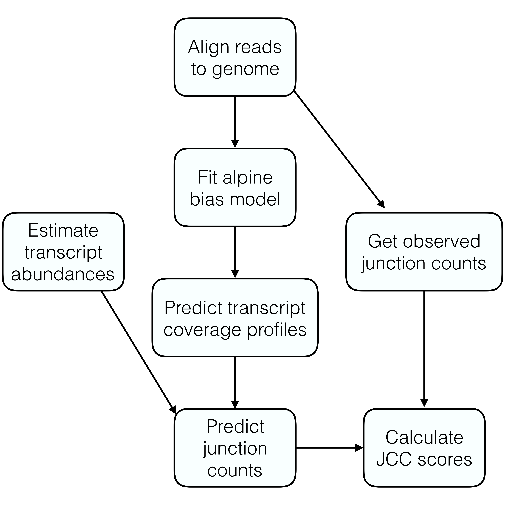

```{r setup, include = FALSE}
knitr::opts_chunk$set(
  collapse = TRUE,
  comment = "#>"
)
```

# Introduction

This vignette describes how to use the `jcc` package to calculate JCC scores [@soneson2018jcc] for a given set of genes. 
The following files are necessary to run the entire workflow, and will be used as described below:

- a BAM file with reads aligned to a reference genome. 
The package has been tested with BAM files generated by the STAR aligner [@dobin2013star].
- a `data.frame` with the number of uniquely mapping and multimapping reads aligned across each annotated splice junction. 
Below we show how to generate such a data frame from the `SJ.out.tab` text file generated by STAR. 
- A `BSgenome` object for the genome that the reads in the BAM file were aligned to.
- A `gtf` file corresponding to the `BSgenome` and the BAM file.
- A transcript-to-gene conversion `data.frame` with at least two columns, named `tx` and `gene`. 
Additional columns providing, e.g., gene symbols can be included.
- A `data.frame` with estimated transcript abundances, with three columns named `transcript`, `TPM` and `count`. 
Note that this table should _not_ contain a column named `gene`.

The general procedure is outlined in the figure below:




```{r, eval = FALSE}
library(jcc)
library(dplyr)
tmp <- readRDS("/Volumes/charlotte/annotation_problem_txabundance/alpine/20151016.A-Cortex_RNA/alpine_fitbiasmodel.rds")
bam <- "/Volumes/charlotte/annotation_problem_txabundance/STAR/20151016.A-Cortex_RNA/20151016.A-Cortex_RNA_Aligned.sortedByCoord.out.bam"
tx2gene <- readRDS("/Volumes/charlotte/annotation_problem_txabundance/reference/Homo_sapiens.GRCh38.90_tx2gene_ext.rds")
tx2gene$gene <- gsub("\\.[0-9]+$", "", tx2gene$gene)
tx2gene$tx <- gsub("\\.[0-9]+$", "", tx2gene$tx)
library(BSgenome.Hsapiens.NCBI.GRCh38)
preds <- predictTxCoverage(biasModel = tmp$fitpar, exonsByTx = tmp$ebt0, 
                           bam = bam, tx2Gene = tx2gene, genome = Hsapiens,
                           genes = c("ENSG00000108106", "ENSG00000037749"), 
                           nCores = 1, verbose = TRUE)
```

```{r, eval = FALSE}
txQuants <- read.delim("/Volumes/charlotte/annotation_problem_txabundance/salmon/cDNAncRNA/20151016.A-Cortex_RNA/quant.sf", header = TRUE, as.is = TRUE)
txQuants$Name <- gsub("\\.[0-9]+$", "", txQuants$Name)
txQuants <- txQuants %>% dplyr::rename(transcript = Name, count = NumReads) %>%
    dplyr::select(transcript, count, TPM)
txsc <- scaleTxCoverages(txCoverageProfiles = preds, 
                         txQuants = txQuants, tx2Gene = tx2gene,
                         strandSpecific = TRUE, methodName = "Salmon", 
                         verbose = TRUE)

```

```{r, eval = FALSE}
jcov <- read.delim("/Volumes/charlotte/annotation_problem_txabundance/STAR/20151016.A-Cortex_RNA/20151016.A-Cortex_RNA_SJ.out.tab", header = FALSE, as.is = TRUE)
colnames(jcov) <- c("seqnames", "start", "end", "strand", "motif", "annot",
                    "uniqreads", "mmreads", "maxoverhang")
jcov <- jcov %>% dplyr::mutate(strand = replace(strand, strand == 1, "+")) %>%
  dplyr::mutate(strand = replace(strand, strand == 2, "-")) %>%
  dplyr::select(seqnames, start, end, strand, uniqreads, mmreads)

combCov <- combineCoverages(junctionCounts = jcov, 
                            predictedCoverages = txsc$allcovs,
                            txQuants = txsc$quants)
```

```{r, eval = FALSE}
jcc <- calculateJCCScores(junctionCounts = combCov$junctions, 
                          txQuantsGene = combCov$genes)
```

